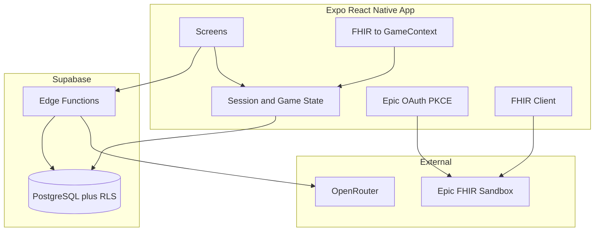
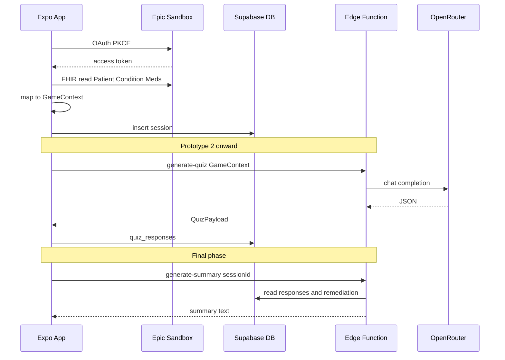

# MAGGIE — System Architecture

## Purpose

MAGGIE is a **mobile learning app** that turns **simulated** Epic FHIR sandbox data into personalized medication-education quiz games. It does **not** use real patient data, does **not** connect to a live EHR, and does **not** provide medical advice.

After gameplay, the app produces a **physician-facing summary of game activity only** (missed concepts, explanations shown, progress). Clinical interpretation stays with the physician.

---

## Architecture decisions (locked for v1)

| Topic | Decision |
|-------|----------|
| **Mobile** | React Native + Expo + TypeScript; demo via Expo Go |
| **Backend** | Supabase only (PostgreSQL + RLS + Edge Functions) — no separate API server unless Epic requires a confidential client secret exchange |
| **Patient identity** | Epic sandbox OAuth patient context; lightweight MAGGIE `session_id` in Supabase — **no** Supabase Auth signup in v1 |
| **Epic auth** | SMART on FHIR with **PKCE** from the mobile app (public client id in app for sandbox) |
| **AI (quiz / remediation / summary)** | OpenRouter called **only** from Supabase Edge Functions — API key never in the mobile app |
| **Clinical data** | Sandbox FHIR only; mapper produces a deterministic `GameContext`; AI never sees raw FHIR bundles |

See [decisions.md](./decisions.md) for rationale.

---

## High-level diagram



---

## End-to-end data flow

1. User opens app and connects via **Epic SMART** (sandbox).
2. App obtains access token (PKCE); stores tokens in **expo-secure-store**.
3. App fetches sandbox **Patient**, **Condition**, and medication resources (see [open-questions.md](./open-questions.md)).
4. **Mapper** converts FHIR JSON → `GameContext` (plain structure for UI and AI).
5. App creates a **session** row in Supabase (`session_id`, `epic_patient_id`, optional `fhir_snapshot`).
6. **(P2)** Edge Function `generate-quiz` sends `GameContext` + approved prompts to OpenRouter → validated quiz JSON.
7. User answers questions; app writes **quiz_responses** (and later **remediation_events**).
8. **(Final)** Edge Function `generate-summary` reads gameplay tables only → physician summary text in app.



---

## Mobile app layers

| Layer | Location (target) | Responsibility |
|-------|-------------------|----------------|
| **UI** | `app/` (Expo Router) | Screens, navigation, accessibility |
| **Features** | `src/features/*` | Auth, quiz, remediation, summary flows |
| **Services** | `src/services/*` | `epicAuth`, `fhir`, `supabase` clients |
| **Domain** | `src/domain/*` | Pure logic: map FHIR → `GameContext`, scoring rules |
| **State** | Context or Zustand | Active `sessionId`, quiz in progress |

**Rules:**

- UI components do not call OpenRouter or hold OpenRouter keys.
- Epic tokens only in **SecureStore**, not AsyncStorage.
- Disclaimers on onboarding and physician summary screens.

---

## Supabase responsibilities

| Component | Role |
|-----------|------|
| **PostgreSQL** | Sessions, quizzes, responses, remediation, summaries |
| **RLS** | Row access policies (see [data-model.md](./data-model.md)) |
| **Edge Functions** | `generate-quiz`, `generate-remediation`, `generate-summary`; optional `epic-token` if Epic app is confidential |

---

## GameContext (internal contract)

Shared between mobile app and Edge Functions (future: `packages/shared`):

```ts
type GameContext = {
  patientDisplayName: string;
  conditions: { code: string; display: string }[];
  medications: {
    name: string;
    reason?: string;
    instructions?: string;
  }[];
};
```

- Built by **deterministic** mapper code, not by the LLM.
- Quiz and remediation prompts use **only** this shape.

---

## Edge Functions

| Function | Phase | Input | Output |
|----------|-------|-------|--------|
| `generate-quiz` | P2 | `sessionId`, `gameContext` | Validated `questions[]` |
| `generate-remediation` | Final | `missedConcept`, `gameContext` | Explanation + follow-up question |
| `generate-summary` | Final | `sessionId` | Summary text from DB gameplay rows only |
| `epic-token` | P1 if needed | Auth code, PKCE verifier | Tokens (only if Epic client is confidential) |

Prompt templates are versioned and **client-approved**; reference template IDs in code and PRs.

---

## Technology map

| Layer | Technology |
|-------|------------|
| Design | Figma, LibreSprite |
| Mobile | React Native, Expo, TypeScript |
| Health data | Epic SMART on FHIR + Epic FHIR Sandbox |
| Backend / DB | Supabase (Postgres, RLS, Edge Functions) |
| AI | OpenRouter (server-side only) |
| Source control | GitHub (`main`, `develop`, feature branches) |
| Demo | Expo Go + Supabase dev project |

---

## Related documents

- [data-model.md](./data-model.md) — tables and RLS  
- [repository-structure.md](./repository-structure.md) — folders and git workflow  
- [prototype-phases.md](./prototype-phases.md) — what to build when  
- [security-and-scope.md](./security-and-scope.md) — compliance boundaries  
