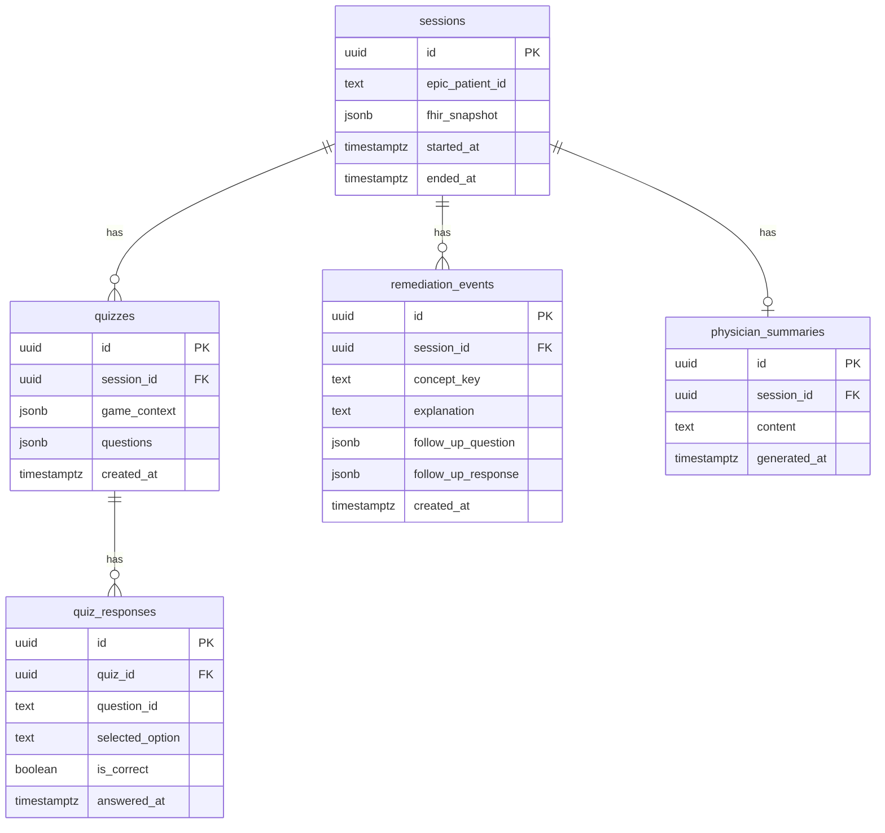

# Data Model (Supabase)

## Overview

All persistent app data lives in **Supabase PostgreSQL**. The mobile app uses the **anon** key with **Row Level Security (RLS)** enabled on every table.

**v1 session model:** No Supabase Auth accounts. Each play-through gets a `sessions.id` (UUID). Gameplay rows reference that `session_id`. Epic sandbox `patient` id is stored for context only.

---

## Entity relationship



---

## Tables

### `sessions` (Prototype 1)

One row per app play-through / demo run.

| Column | Type | Notes |
|--------|------|-------|
| `id` | `uuid` PK | Generated client-side or DB default |
| `epic_patient_id` | `text` | From Epic token / FHIR Patient |
| `fhir_snapshot` | `jsonb` | Optional cached sandbox bundle |
| `started_at` | `timestamptz` | Default `now()` |
| `ended_at` | `timestamptz` | Nullable |

### `quizzes` (Prototype 2)

| Column | Type | Notes |
|--------|------|-------|
| `id` | `uuid` PK | |
| `session_id` | `uuid` FK → `sessions` | |
| `game_context` | `jsonb` | Snapshot used for generation |
| `questions` | `jsonb` | Validated quiz payload |
| `created_at` | `timestamptz` | |

### `quiz_responses` (Prototype 2)

| Column | Type | Notes |
|--------|------|-------|
| `id` | `uuid` PK | |
| `quiz_id` | `uuid` FK → `quizzes` | |
| `question_id` | `text` | Stable id within quiz JSON |
| `selected_option` | `text` | |
| `is_correct` | `boolean` | |
| `answered_at` | `timestamptz` | |

### `remediation_events` (Final)

| Column | Type | Notes |
|--------|------|-------|
| `id` | `uuid` PK | |
| `session_id` | `uuid` FK | |
| `concept_key` | `text` | e.g. condition or med concept |
| `explanation` | `text` | Shown after wrong answer |
| `follow_up_question` | `jsonb` | |
| `follow_up_response` | `jsonb` | Nullable until answered |
| `created_at` | `timestamptz` | |

### `physician_summaries` (Final)

| Column | Type | Notes |
|--------|------|-------|
| `id` | `uuid` PK | |
| `session_id` | `uuid` FK | One summary per session (or versioned later) |
| `content` | `text` | Gameplay-only narrative |
| `generated_at` | `timestamptz` | |

---

## RLS strategy (v1 capstone)

**Goal:** Enable demo inserts/selects with anon key while avoiding open-ended public data access.

**Recommended starting point:**

1. `ALTER TABLE ... ENABLE ROW LEVEL SECURITY` on all tables.
2. Policies that allow `insert` and `select` where `id = session_id` passed from client (document limitations in [security-and-scope.md](./security-and-scope.md)).
3. Edge Functions use **service role** only inside Deno functions, never exposed to mobile.

**Optional hardening (later):**

- Edge Function issues short-lived JWT with `session_id` claim after Epic auth.
- Stricter policies bound to that claim.

---

## Migration ownership

- SQL migrations live in `supabase/migrations/`.
- **Primary owner:** Malek (Backend / Data Lead).
- All schema changes go through PR review; include RLS policies in the same migration as table creation.

---

## Example migration sketch (P1)

```sql
create table public.sessions (
  id uuid primary key default gen_random_uuid(),
  epic_patient_id text not null,
  fhir_snapshot jsonb,
  started_at timestamptz not null default now(),
  ended_at timestamptz
);

alter table public.sessions enable row level security;

-- Replace with team-agreed policy before production demo
create policy "sessions_anon_insert"
  on public.sessions for insert to anon with check (true);

create policy "sessions_anon_select"
  on public.sessions for select to anon using (true);
```

Tighten policies before any audience beyond course demo if required by GTA/client.
